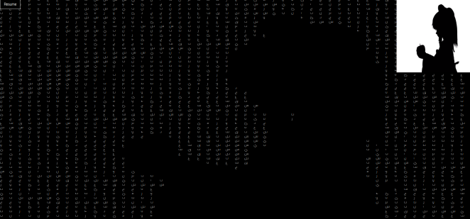
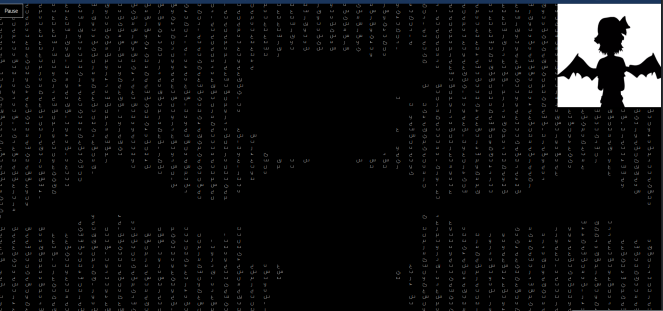

# Bad Apple Javascript

## Bad apple being played on the web in real timish, using OpenCv, and vanilla javascipt.
### live site: https://bad-apple-javascript.netlify.app/

## steps to create this:

<ol>
<li>create a matrix of divs with the same dimension of the video, scaled to cover whole screen</li>
<li>load video frame by frame using openCV</li>
<li>convert each frame color space to gray</li>
<li>apply binary thresholding on eachframe</li>
<li>for each pixel replace each div with whatever you want(in my case arabic letters) depending on the pixel color</li>
<ol>
